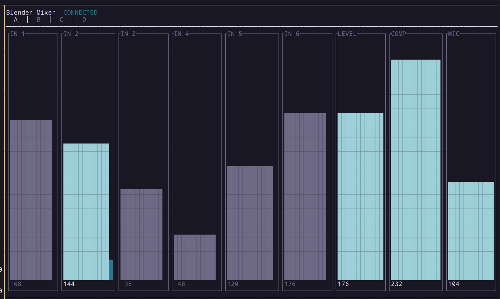
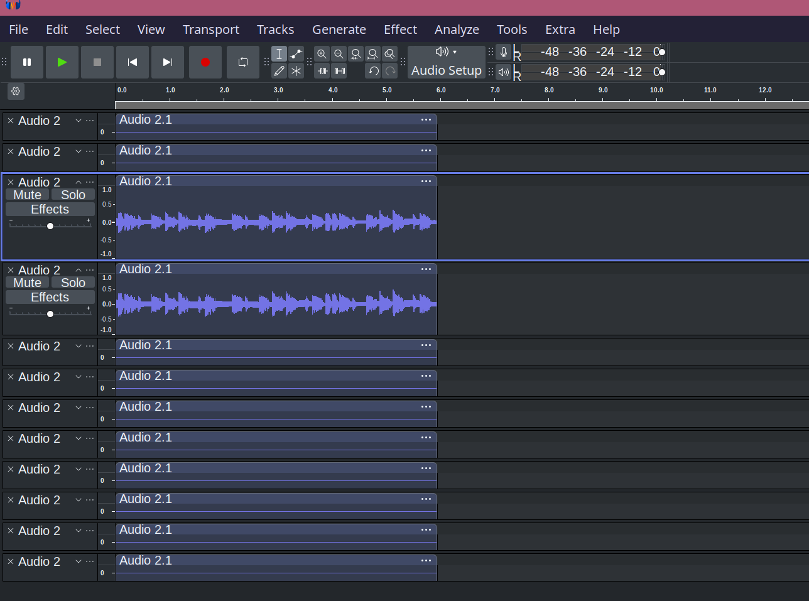

# TC Helicon Blender — Linux Support

Full Linux support for the [TC Helicon Blender](https://www.tc-helicon.com/product.html?modelCode=0621-AAR), a 12x8 stereo monitor mixer and 12x2 USB audio interface. The Blender was designed for Windows/Mac with an Android/iOS companion app. This project provides:

- **Kernel patches** to make the USB audio interface work with ALSA
- **BLE control** to replace the mobile app
- **PipeWire config** to split the 12-channel capture into 6 stereo inputs



## Hardware

| | |
|---|---|
| **USB** | Vendor `0x1220` (TC Electronic), Product `0x8FE1` |
| **Audio** | 12 capture channels (6 stereo inputs), 2 playback channels, 24-bit 48kHz |
| **Control** | Bluetooth LE (GATT) — 3-byte tuple protocol |
| **SoC** | TCAT DICE3 (ARM926EJ-S) with separate BLE module |
| **Firmware** | v1.2.8.2, Oct 2018 |
| **Sister devices** | GoXLR (`0x8FE0`), GoXLR Mini (`0x8FE4`) — same USB quirks |

See [Protocol.md](Protocol.md) for the full BLE and USB protocol reference.

## Kernel Patches

The Blender's DICE3 USB core requires a vendor-specific init sequence before ALSA can use it. Without it, isochronous transfers fail. Two patches against Linux 6.17 in [`kernel-patches/`](kernel-patches/):

1. **Boot quirk** — 5-step init sequence (vendor read, SET_CUR 48kHz, vendor write, 1s sleep, vendor read) activates USB audio streaming
2. **Fixed-rate + clock validity** — works around a DICE3 hardware bug where class IN transfers >2 bytes corrupt the data phase, and overrides bogus clock-invalid reports during PLL lock

### Install via DKMS

```bash
sudo kernel-patches/build-dkms.sh        # build & install
sudo modprobe -r snd_usb_audio && sudo modprobe snd_usb_audio
```

After installation, the Blender appears as a standard ALSA device:

```
$ arecord -l
card 2: Blender [Blender], device 0: USB Audio [USB Audio]
  Subdevices: 1/1
  Subdevice #0: subdevice #0
```

## PipeWire Channel Splitting

The Blender exposes a single 12-channel ALSA capture device. PipeWire can split it into 6 named stereo sources so each input appears individually in your mixer and DAW:


### Channel Map

| Channels | Input | Physical jack |
|----------|-------|---------------|
| AUX0, AUX1 | Input 1 | Stereo pair 1 |
| AUX2, AUX3 | Input 2 | Stereo pair 2 |
| AUX4, AUX5 | Input 3 | Stereo pair 3 |
| AUX6, AUX7 | Input 4 | Stereo pair 4 |
| AUX8, AUX9 | Input 5 | Stereo pair 5 |
| AUX10, AUX11 | Input 6 | Stereo pair 6 |

### Setup (WirePlumber)

The recommended approach uses a WirePlumber Lua script that dynamically creates/destroys loopback sources when the Blender is plugged in or removed.

**1. Install the Lua script:**

```bash
mkdir -p ~/.local/share/wireplumber/scripts
cp pipewire/blender-loopbacks.lua ~/.local/share/wireplumber/scripts/
```

**2. Install the WirePlumber config:**

```bash
mkdir -p ~/.config/wireplumber/wireplumber.conf.d
cp pipewire/51-blender-loopbacks.conf ~/.config/wireplumber/wireplumber.conf.d/
```

**3. Restart WirePlumber:**

```bash
systemctl --user restart wireplumber
```

The 6 stereo sources appear automatically when the Blender is connected and disappear on unplug.



## blender-ctl

Rust CLI and TUI for controlling the Blender's mixer over Bluetooth LE. Replaces the Android/iOS companion app.

```bash
cd blender-ctl
cargo build --release
```

### TUI Mode

```bash
blender-ctl tui
```

Per-bus tab view with vertical bar gauges, real-time PipeWire peak metering, and vim-style navigation:

| Key | Action |
|-----|--------|
| `Tab` / `Shift+Tab` | Switch bus (A/B/C/D) |
| `h`/`l` or arrows | Navigate columns |
| `j`/`k` or arrows | Adjust value (Shift for coarse) |
| `m` | Toggle mute |
| `c` | Toggle compressor |
| `t` | Toggle talkback |
| `q` | Quit |

Unplugged inputs are dimmed. Input columns show a PipeWire peak meter alongside the gain bar when USB audio is active.

### CLI Mode

```bash
blender-ctl set input1 200           # set input 1 on all buses
blender-ctl set level 176 --bus 0    # set level on bus A only
blender-ctl get                      # dump all parameters
blender-ctl ble                      # interactive REPL
```

### USB Commands

```bash
blender-ctl usb init    # run boot quirk from userspace
blender-ctl usb info    # show USB descriptors
blender-ctl usb dcp 0x02  # send DCP command
```

### Crate Structure

| Crate | Description |
|-------|-------------|
| `blender-proto` | Parameter IDs, tuple codec, mixer state, DCP framing |
| `blender-ble` | BLE central client via btleplug (scan, connect, notify, handshake) |
| `blender-usb` | USB device control via rusb (init sequence, DCP commands) |
| `blender-tui` | Ratatui TUI with per-bus tabs and PipeWire peak metering |

### Dependencies

- Rust 2024 edition
- BlueZ (for BLE via btleplug)
- libusb (for USB via rusb)
- PipeWire + libpipewire-dev (optional, for audio peak meters)

## Firmware Analysis

`blender_flash_dump.bin` is a 1MB flash dump from the Blender's ARM926EJ-S (DICE3) obtained via JTAG. Key findings from Ghidra reverse engineering:

- Mixer control is **entirely via BLE** — USB DCP has no mixer command handlers
- BLE parameter values are quantized to 5 bits (0-31) internally, transmitted as 0-255 over BLE
- Mute is a global boolean, not per-bus
- Compressor on/off is a per-bus bitmap (bit 3 = bus A, bit 0 = bus D)
- Jack sense bitmaps use MSB-first ordering

The Ghidra project for the Windows driver analysis is in [`apps/blender-windows/`](apps/blender-windows/).

### JTAG

OpenOCD config and scripts for the DICE3 ARM core are in [`jtag/`](jtag/). The `inject_bt_oneshot.tcl` script can trigger BLE pairing mode via JTAG without pressing the physical button.

## Repository Structure

```
kernel-patches/          Kernel patches + DKMS build script
blender-ctl/             Rust workspace (CLI, TUI, BLE, USB, protocol)
pipewire/                PipeWire/WirePlumber channel splitting configs
udev/                    udev rules + init script (fallback for unpatched kernels)
images/                  Screenshots
apps/blender-windows/    Ghidra project (Windows driver RE)
apps/firmware/           GoXLR firmware (sister device, for comparison)
blender_flash_dump.bin   Blender firmware flash dump (JTAG)
Protocol.md              Full BLE + USB protocol reference
jtag/                    OpenOCD config, JTAG scripts, and scan captures
blender_ble.py           Python BLE client prototype (bleak)
```

## License

This is a personal reverse-engineering project. The firmware dumps and decompiled apps are copyrighted by TC Electronic / TC Helicon. The Rust code, kernel patches, scripts, and documentation are my own work.
